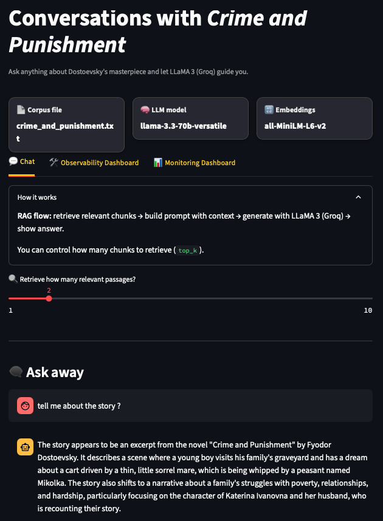
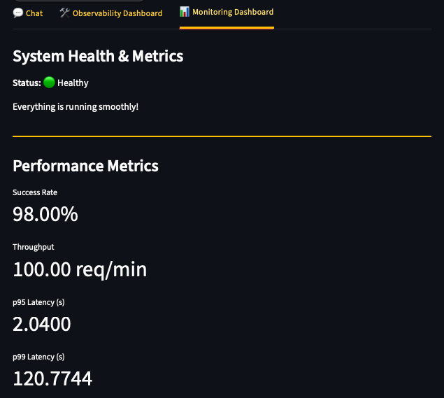

# RAGbot — Conversations with *Crime and Punishment*

>**Live App**: [Click here to try RAGbot on Streamlit](https://hsjoi0214-ragbot-appstreamlit-app-xxc6lx.streamlit.app/)

>**Medium Article**: [The Complete Guide to RAG, Part I: Operational Mechanics](https://medium.com/@prakash1402/the-complete-guide-to-rag-part-i-operational-mechanics-9365ba12b241)

>**Medium Article**: [The Complete Guide to RAG, Part II: Setup, Design and Application](https://medium.com/@prakash1402/the-complete-guide-to-rag-part-ii-setup-design-and-application-cb0b415106e3)


This project accompanies a long-form Medium article that explains Retrieval-Augmented Generation (RAG) in depth and walks through its implementation. The final solution is packaged in a user-friendly **Streamlit App**, allowing anyone to experiment with building a simple RAGbot.ves.

---

## Objective

The goal of this project is to provide an **interactive Retrieval-Augmented Generation (RAG) chatbot** that allows users to explore the novel *Crime and Punishment* by Fyodor Dostoevsky in a conversational manner.  
By combining **document retrieval** with **large language model generation**, RAGbot delivers contextually accurate, memory-aware responses to literary and philosophical questions about the text.

---

## Project Strategy

This app follows a **retrieval + generation** architecture using **LlamaIndex**, **HuggingFace embeddings**, and **Groq’s LLaMA 3 model**.

### Workflow Overview
1. **Document Loading**  
   The full text of *Crime and Punishment* (plaintext file) is ingested using `SimpleDirectoryReader`.
   
2. **Embedding & Indexing**  
   - Uses **sentence-transformers/all-MiniLM-L6-v2** for text embeddings.  
   - Indexed into a vector store for fast semantic search.
   
3. **Context Retrieval**  
   - Retrieves the top-*k* most relevant passages for each query.  
   - `top_k` is configurable in the UI.

4. **Generation with Context**  
   - Groq's **LLaMA 3.3 70B Versatile** model is used for answer generation.  
   - Responses are grounded in retrieved context to reduce hallucination.

5. **Memory-Aware Conversations**  
   - Maintains a buffer of conversation history so the chatbot can respond coherently over multiple turns.

---

## Why This Approach Works

| Component | Purpose | Benefit |
|-----------|---------|---------|
| **HuggingFace Embeddings** | Encode text into vector space | Enables accurate semantic search |
| **VectorStoreIndex** | Store embeddings for fast retrieval | Low-latency, scalable context retrieval |
| **Groq LLaMA 3.3 70B** | Generate answers from context | High-quality, human-like responses |
| **ChatMemoryBuffer** | Store chat history | Provides conversational continuity |
| **Streamlit UI** | Easy web interface | Quick deployment & interaction |

---

## Tools & Libraries

- **Languages**: Python
- **Frameworks**: Streamlit, LlamaIndex
- **Embeddings**: sentence-transformers/all-MiniLM-L6-v2
- **LLM Provider**: Groq (LLaMA 3.3 70B Versatile)
- **Others**: python-dotenv for secrets, pathlib for file handling

---

## Key Features

- **Semantic Search** — Retrieves the most relevant text excerpts from *Crime and Punishment*.
- **Memory-Aware Chat** — Keeps track of past exchanges for contextually coherent conversations.
- **Adjustable Context Depth** — `top_k` slider to control how many passages to retrieve.
- **Streamlit UI** — Simple, elegant web app interface.
- **Configurable API Keys** — Supports `.env` or `.streamlit/secrets.toml`.

---

## Observability & Monitoring

### Concept
Observability makes internal behavior visible so we can diagnose why a request was fast/slow or correct/incorrect. It helps pinpoint areas for optimization or performance improvements.

### What We Capture & Why

- **Trace**: The end-to-end record of a single request.
- **Span**: A timed sub-operation within a trace.  
Each user query generates three spans:
   - **retrieve.topk**: Time taken to perform vector search for relevant chunks.
   - **engine.chat**: Time taken by the LLM to generate the answer.
   - **rag.e2e**: End-to-end time, from the user’s prompt to the final answer.

These spans are stored in `local_traces.json`, and the DIY Observability tab computes recent averages and displays per-request performance.

### Intuition
Traces reveal where the time is spent. For example, if retrieval is consistently fast, but generation times are long, this suggests focusing on model/runtime settings rather than the index.

### Walkthrough (Illustrative)
1. The user asks a question, and a new `request_id` and `session_id` are assigned.
2. The retriever logs `k`, hit count, and best similarity score for **retrieve.topk**.
3. The LLM call logs **engine.chat** for the generation process.
4. The app logs **rag.e2e** for total roundtrip time.
5. The observability dashboard displays average times for retrieval, generation, and roundtrip, along with a chart for quick visual comparison.

In simple terms, the Observability tab helps you understand where the time goes by showing the details behind each request.

---

### Monitoring: What We Capture & Why

Monitoring helps track a few known signals over time, allowing you to spot issues like drift or outages quickly.

Core metrics:
- **Availability / success rate**: 1 − (errors/requests)
- **Throughput**: Requests per minute.
- **Latency percentiles**: Response time under which 95% and 99% of requests complete.
- **Health checks**: Ensures API key, corpus file, and index are present.

In the app:
- **Health**: Shows system status (green/red) with inline reasons for issues (e.g., missing API key, absent corpus file).
- **Performance**: Success rate, throughput, and latency (p95/p99) are calculated from recorded request durations.
- **Monitoring Dashboard**: Provides a high-level view of system health and performance, with compact metrics for quick troubleshooting.

Intuition: Monitoring acts as the “smoke alarm” for the system. If something goes wrong, it provides enough information to trigger further investigation in the Observability tab.

---

## Screenshots

### 1. Main Chat Interface
This is the primary interface where users interact with the RAGbot.  
You can ask questions about *Crime and Punishment* and receive context-grounded answers generated by Groq’s LLaMA 3 model.  
A slider allows you to adjust how many relevant text passages (`top_k`) are retrieved per query.



---

### 2. Observability Dashboard
The observability dashboard provides detailed timing metrics for each request:
- **Find passages** — time to retrieve relevant chunks.  
- **Write answer** — time for the LLM to generate the response.  
- **Total roundtrip** — end-to-end time from question to answer.  

This view helps identify bottlenecks and monitor efficiency.

#### **With end-to-end time, 0.88 seconds**


---

### 3. Performance Trace Graph
This chart visualizes request timings over multiple queries.  
It highlights spikes in latency (e.g., long generation times) and makes it easy to compare **retrieval**, **generation**, and **roundtrip** performance across sessions.

#### **1: With end-to-end time - ONLY FOR THE CURRENT SESSION, 0.88 seconds**


---
#### **1: With end-to-end time - FOR ALL SESSIONS UNTIL NOW**


---

### 4. Monitoring Dashboard
The monitoring dashboard gives a high-level system health overview:
- **Status** — overall health of the system.  
- **Performance Metrics** — success rate, throughput, and latency (p95 / p99).  

This ensures the chatbot is running reliably and performing at scale.



---

## Architecture Diagram


**Architecture Steps:**
1. **User Query** → Enters prompt in Streamlit chat UI.  
2. **Retriever** → Queries vector store for top-*k* relevant passages.  
3. **LLM** → Groq LLaMA 3.3 70B processes query + retrieved context.  
4. **Response** → Sent back to Streamlit UI and added to memory buffer.  
5. **Conversation History** → Maintains context for multi-turn dialogue.  

---

## Project Structure

```text
ragbot_crime_and_punishment/
│
├── data/
│   └── crime_and_punishment.txt   # The full text of Crime and Punishment
│
├── storage/
│   └── vector_index/              # Persistent vector index data
│
├── .streamlit/
│   └── secrets.toml               # Optional API keys for deployment
│
├── app/
│   ├── streamlit_app.py           # Main Streamlit application that runs the RAGbot
│   ├── config.py                  # Configuration settings (API keys, paths, etc.)
│   ├── metrics.py                 # Metrics for monitoring and observability
│   ├── tracing.py                 # Trace recording for performance and observability
│   ├── feedback.py                # (Optional) Feedback collection module
│
├── requirements.txt               # Python dependencies
├── .env                           # Local development secrets
├── README.md                      # Project description (this file)
```

## Installation & Usage

### Clone this Repository
```bash
git clone https://github.com/hsjoi1402/ragbot-crime-and-punishment.git
cd ragbot-crime-and-punishment
```

### Install Dependencies
```bash
pip install -r requirements.txt
```

### Configure API Key
Set your Groq API key in .env:
```bash
GROQ_API_KEY=your_api_key_here
```

### Run the App
```bash
streamlit run app.py
```
The app will open in your browser at:
http://localhost:8xxx

---

## How It Works (Step-by-Step)
1. Load the novel text from /data/crime_and_punishment.txt.
2. Embed & Index: Create a vector index using HuggingFace embeddings.
3. Persist Index: Store it in /storage/vector_index for reuse.
4. Retrieve Context: On user queries, fetch top-k relevant passages.
5. Generate Answer: Send the context to Groq's LLaMA 3.3 model.
6. Display & Store: Show answer in chat UI and add to conversation history.

---

## Example Queries
1. What is Raskolnikov’s moral struggle?
2. Summarize the conversation between Raskolnikov and Sonia.
3. How does Dostoevsky portray guilt in the novel?

---

## Observability & Monitoring
1. Observability Dashboard → Request timings (retrieval, generation, roundtrip).
2. Performance Graphs → Latency breakdowns across recent queries.
3. Monitoring Dashboard → Success rate, throughput, and system health.

These dashboards make it easy to debug latency spikes, track throughput, and ensure reliability.

---

## Deployment
The app is Streamlit-ready and can be deployed:
1. Locally (via streamlit run)
2. On Streamlit Cloud with .streamlit/secrets.toml
3. In a Docker container for production

---

## Contribution Guidelines
Pull requests are welcome!
Future improvements:
1. Add multi-document support and routing.
2. Enhance UI with richer formatting.
3. Integrate summarization features.
4. Retrieve links and sources with answers.

---

## Author
Prakash

---

## Acknowledgements
1. **Fyodor Dostoevsky** — For writing Crime and Punishment.
2. **ChatGPT (OpenAI)** — For providing boilerplate code, improving scripts, and assisting with comments, docstrings, and documentation.